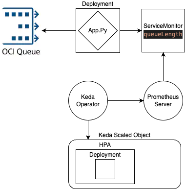

# 📈 OCI Queue-Based HPA with KEDA on OKE

This project demonstrates how to build an **event-driven auto-scaling solution** using:

- 📬 **OCI Queue** for workload queuing  
- ⚖️ **KEDA (Kubernetes Event-Driven Autoscaler)** for horizontal pod autoscaling (HPA)  
- 🚀 **OKE (Oracle Kubernetes Engine)** as the Kubernetes platform

Optional - 
- 📊 **Prometheus** for custom metrics collection

The deployment will automatically scale based on the **number of messages in an OCI Queue**, enabling dynamic handling of load.

You can choose wheter or not to use Prometheus to gather the metric and use a Prometheus Keda scaled object which will digest the metric from Prometheus or; digest the metric directly from a Keda scaledobject from the exporter service without relying on Prometheus - i have set up two different scaledObjects manifests for this end. 

---

## ✅ Prerequisites

Make sure you have the following ready before deploying:

1. ✅ An [OKE Cluster](https://docs.oracle.com/en-us/iaas/Content/ContEng/Concepts/contengoverview.htm) up and running  
2. ✅ [KEDA installed](https://keda.sh/docs/2.9/deploy/#install) in the cluster  
3. ✅ An [OCI Queue](https://docs.oracle.com/en-us/iaas/Content/queue/queue-create.htm) configured  
4. ✅ Proper OCI IAM Policies in place (see [`IAM-Policy.txt`](./IAM-Policy.txt))

Optional - If using Prometheus - 

5. ✅ [Prometheus Helm Chart](https://github.com/prometheus-community/helm-charts/tree/main/charts/prometheus) installed

---

## 🔐 IAM Policies

To allow your app (and the Prometheus exporter) to access the OCI Queue securely, this example uses:

- **Granular IAM permissions**
- **OCI Workload Identity**  
- **Kubernetes service account bindings**  

This approach avoids using broad access keys and provides safer, fine-grained access.

You can find a sample policy in [`IAM-Policy.txt`](./IAM-Policy.txt).

---

## 🧭 Architecture

The architecture below illustrates how metrics are collected from the OCI Queue and drive auto-scaling in the cluster:


---

## 📦 Components Overview

| Component            | Description                                                                 |
|----------------------|-----------------------------------------------------------------------------|
| `exporter.py`        | Python Prometheus exporter that pulls message stats from OCI Queue          |
| `ServiceMonitor`     | Scrapes the exporter metrics for Prometheus                                 |
| `Prometheus`         | In-cluster monitoring, collects metrics and exposes them to KEDA            |
| `KEDA`               | Reads queue length metrics and adjusts replicas accordingly (via HPA)       |
| `HPA + Deployment`   | Your actual workload, scaled by KEDA based on queue depth                   |

---

## 🚀 Usage

## 🚀 Deployment Steps

This section outlines how to deploy the event-driven autoscaling solution using OCI Queue, Prometheus(optional), and KEDA on OKE.

### ✅ Prerequisites

Make sure the following are ready:

- An operational **OKE (Oracle Kubernetes Engine)** cluster.
- An **OCI Queue** created and ready to receive messages.
- **IAM Policies** allowing access to OCI Queue and related resources.
- (Optional) **Prometheus** installed on your OKE cluster (for metrics collection).
- **KEDA** installed on your OKE cluster (for event-driven scaling).

> ℹ️ [Install KEDA guide](https://keda.sh/docs/2.14/concepts/scaling-deployments/)

---

### 📦 Deployment Steps

1. **Clone this repository**:

    ```bash
    git clone https://github.com/ronsevetoci/oke-keda-oci-queue-scale.git
    cd oke-keda-oci-queue-scale
    ```

2. **Update environment configurations**:

    - Edit `manifests/deploy.yaml`:
      - Replace the placeholders with your OCI Queue **OCID** and **Region**.
      
3. **Deploy the application**:

    ```bash
    kubectl apply -f manifests/deploy.yaml
    ```

5. Optional(when using Prometheus to digest the metric) - **Deploy the Prometheus ServiceMonitor**:

    ```bash
    kubectl apply -f servicemonitor.yaml
    ```

    > This will allow Prometheus to scrape metrics from the application.


4. **Deploy the KEDA ScaledObject**:

    When using Prometheus -
    ```bash
    kubectl apply -f manifests/scaledObject.yaml
    ```
    When digesting directly from KEDA without Prometheus - 
    ```bash
    kubectl apply -f manifests/scaledObject_noProm.yaml
    ```

---

### 🧪 Testing the Setup

1. **Send test messages to the queue**:

    You can add messages to the queue directly from the UI, CLI or via SDK.
   
3. **Monitor autoscaling behavior**:

    Watch the pod scaling:

    ```bash
    kubectl get pods -w
    ```

    As messages increase in the queue, KEDA should trigger new pod creation. When the queue is drained, the pods should scale back down.

---

### 🧹 Cleanup

To remove all deployed resources:

```bash
kubectl delete -f manifests/servicemonitor.yaml
kubectl delete -f manifests/scaledObject.yaml
kubectl delete -f manifests/deploy.yaml

---

## 📜 License

MIT — see [`LICENSE`](./LICENSE)
